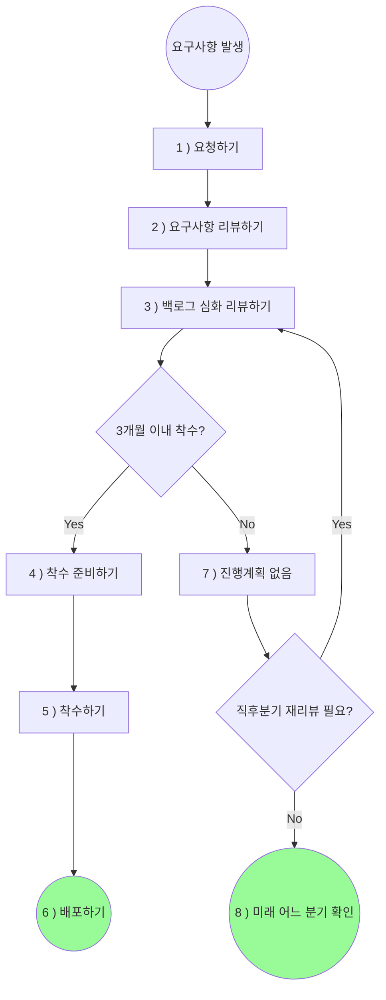

# Product-Backlog-Review
## 프로토콜 작성 배경
**파편화된 업무 요청 채널의 일원화 필요성**
- 현재 다양한 슬랙 채널, DM, 구두 전달 등 여러 경로를 통해 개발팀과 프로덕트 팀에게 업무 요청이 전달되고 있어, 요청된 업무들 간의 우선순위를 파악하기 어렵습니다.

**진행 중인 Task와 논의 사항의 현황 파악 어려움**
- 요청된 아이디어나 업무의 진행 상태를 명확히 파악하기 어렵습니다.

## 백로그 수집 목표
- 프로덕트 오너의 역할 및 책임(R&R) 변경에 따라, 전사적 관점에서 요구사항을 수집하고 이를 통해 더 나은 고객 가치를 제공하는 것을 목표로 합니다.
- 수집된 백로그는 아래의 ‘백로그 보드 관리 원칙’에 따라 체계적으로 관리하여, 누구나 고객 가치 향상에 기여할 수 있는 프로세스를 구축하고자 합니다.

## 백로그 보드 관리 원칙
- 투명성
    - 누구나 백로그를 통해 진행 중인 작업과 설정된 우선순위를 명확히 파악할 수 있습니다.
- 일관성
    - 백로그 항목의 기록과 관리 방식이 표준화되어, 모든 사용자가 쉽게 이해할 수 있도록 합니다.
- 명확성
    - 우선순위 설정 기준을 명확히 하고, 이해관계자가 이를 쉽게 이해할 수 있도록 합니다.
    - 우선순위 결과는 직관적으로 확인할 수 있어야 합니다.
- 최신성
    - 백로그는 항상 최신 상태로 유지되며, PO가 주기적으로 업데이트를 수행합니다.

# 보드 설명
## 1.제품팀 업무 요청 보드
[제품팀 업무 요청 보드](https://www.notion.so/173c15b21065806a827dc032dc8beebe?pvs=21)
- 설명
    - 요청자가 업무 효율성 개선 / 협조 요청 또는 신규기능 제안을 등록할 수 있는 공간으로, 누구나 해당 공간에 요구사항을 작성할 수 있습니다.
    - 이하 요청자가 요청한 것을 '요구사항', 요구사항이 작성된 문서를 '요구사항 문서'라고 합니다.
    - 요청 원본을 유지하기 위해 특정 단계 이후에는 해당 문서를 '잠금' 처리하며, 이후의 업데이트는 댓글을 통해 진행합니다.
    - <제품팀 업무 요청 보드>의 요구사항 문서와의 업무협조/도움 요청 백로그 문서 간 연결을 통해 진행 상황을 쉽게 확인할 수 있어야 합니다.
- 역할 정의
    - 요청자
        - Product 팀에게 '요구사항'을 전달하기 위해 '요구사항 문서'를 작성한 사람
        - 요청자는 <1. 요청하기>에 명시된 방법에 따라 PO에게 요구사항 문서를 전달한다.
    - PO:
        - Product Team을 대표하여 요청자로부터 요구사항을 접수하는 사람
        - PO는 정기적으로 <제품팀 업무 요청 보드>를 검토하여 최신 상태로 유지할 책임이 있다.
- <가치 평가 및 진행 프로세스>내 단계
    - 가치 평가 및 진행 프로세스의 첫 번째 단계인 '1. 요청하기'가 해당됨

## 2. 제품팀 현황 보드 (Product Backlog Board)
- [제품팀 업무 현황 보드(Product Backlog Board)](https://www.notion.so/Product-Backlog-Board-173c15b210658032ae8bee77d4a8f64e?pvs=21)
- 설명
    - 백로그 항목(작업, 기능, 아이디어 등)을 시각적으로 정리하고 관리하는 공간입니다. 칸반(Kanban) 스타일로 구성되어 있어 백로그 항목들의 진행 상태를 명확하게 파악할 수 있습니다.
    - 요청자가 제출한 정제된 내용을 '백로그'라 하며, 이를 문서화한 것을 '백로그 문서'라고 합니다.
    - 백로그 문서는 PO만이 수정할 수 있으며, 다른 사용자는 코멘트 작성과 조회만 가능합니다.
    - 문서의 무결성과 일관성 유지를 위해 백로그 문서의 수정 권한은 Product Owner(PO)에게만 부여됩니다. 이해관계자들은 코멘트를 통해 피드백을 제공하거나 문서를 조회할 수 있습니다.
- 역할 정의
    - 요청자
        - Backlog Board에 등록된 문서는 수정이나 삭제가 불가하며, 코멘트 작성과 조회만 할 수 있다.
    - PO.
        - PO는 Backlog Board를 최신 상태로 유지해야 할 책임이 있다.
        - 백로그 문서의 작성과 진행 상황을 성실히 업데이트한다.
- <가치 평가 및 진행 프로세스> 내 단계
    - <가치 평가 및 진행 프로세스>의 두 번째 단계부터 모든 단계가 해당 보드에서 이루어진다.

# 가치평가 및 진행 프로세스

도식화

## [요청하기 단계]
### 1. 요청하기

- 단계 설명
    - 프로덕트 팀에게 신규기능 제안, 업무 효율성 개선을 위한 요청 또는 다른 협조 요청, 버그를 리포트하는 단계입니다.
    - 이 단계는 <제품팀 업무 요청 보드>에서 이루어집니다.
- 상태 업데이트 주기(= 작성 업데이트 주기)
    - 여러 팀에서 자유롭게 작성할 수 있어 별도의 작성 주기를 두지 않습니다.
- 산출물:
    - Backlog Board 내 요구사항 문서
- 요구사항 특징에 따른 템플릿 :
    - 요구사항은 버그, 신규기능 제안, 업무 효율성 개선 / 협조 요청 의 3가지 유형으로 분류되며, 각 유형별로 전용 템플릿이 존재합니다. 
        - 버그
            - 서비스 상 버그 발견 시 '버그' 템플릿을 사용합니다.
            - 사용자로부터 전달받은 버그는 주로 운영팀에서 작성할 것으로 예상됩니다.
            - CMS도 포함 (작성 허들을 낮추기 위해), 내부 직원이 발견한 버그는 확인 후 PO가 작성합니다
                - 반드시 @PO를 멘션합니다.
            - 버그는 다른 요구사항보다 빠른 대응이 필요한 특성을 가집니다.
        - 신규기능 제안
            - 현재 프로덕트에 존재하지 않는 기능 중, 추가되거나 개선될 경우 사용자에게 가치를 제공하거나 행동 변화를 유도할 수 있는 기능 또는 아이디어인 경우에는 ‘신규기능 제안’ 템플릿을 사용합니다.
        - 업무 효율성 개선 / 협조 요청
            - 사용자에게 직접적인 가치를 제공하지는 않지만, CMS나 인프라 등 업무 효율성을 높이기 위한 요청 사항으로, 프로덕트 또는 개발팀의 협조나 지원이 필요한 경우에는 ‘업무 협조/도움 요청’ 템플릿을 사용합니다.
- 작성자의 역할
    - 작성자는 요구사항 문서를 성실히 작성한 후 문서의 상태를 '작성 완료'로 변경합니다
    - 상태 변경 후 별도로 PO를 멘션할 필요가 없습니다 (상태가 변경되면 자동으로 #**request-board-noti** slack 채널에 알림이 전달됨)
- PO의 역할
    - PO는 ‘작성 완료’ 완료 된 문서를 ‘확인 완료’로 변경합니다.
    - 최근 등록된 백로그 중 담당한 항목이 없는 PO가 있을 경우, PO는 본인을 해당 백로그의 담당자로 직접 할당해야 합니다.
- 기타
    - 단, 과거에 동일한 요청 내역이 있는 경우에는 <제품팀 업무 요청 보드>에 작성하지 않으며, 이번 업무 프로세스 변경의 영향을 받지 않습니다.
        - 예시
            - amplitude 데이터 추가 요청
            - TTF 전환 요청
            - 띠배너 추가/삭제 요청
            - 리딤코드 추가 생성 요청
    

## [리뷰단계]

### 2. 요구사항 리뷰하기

- 단계 설명
    - <제품팀 업무 현황 보드> 에서의 단계
    - <제품팀 업무 현황 보드>의 '요구사항 리뷰중' 단계에서는 <제품팀 업무 요청 보드>에 작성된 요구사항 문서를 기반으로 요청자와 PO가 추가 피드백을 주고받습니다.
    - PO는 ‘버그’, ‘신규기능 제안’, ‘업무 효율성  개선 / 협조’ 가치평가에 따라 요청자에게 추가 정보를 확인할 수 있습니다.
- 산출물
    - <제품팀 업무 요청 보드>에 생성된 요구사항 문서의 상태값이 '요청함'에서 'PO에게 전달함'으로 변경됨
    - <제품팀 업무 현황 보드>에 생성된 정리된 백로그 문서
- 담당자
    - 지정된 PO

### 3. 백로그 심화 리뷰하기
는 backlog-indepth-review를 참고
